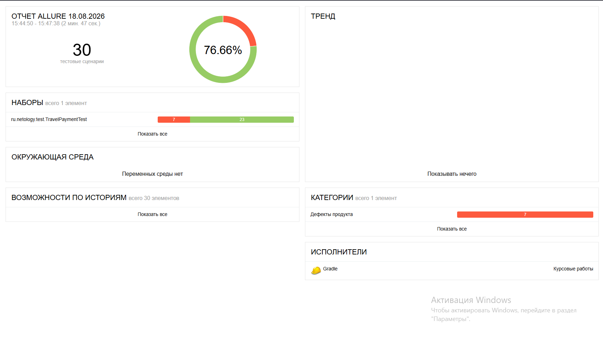
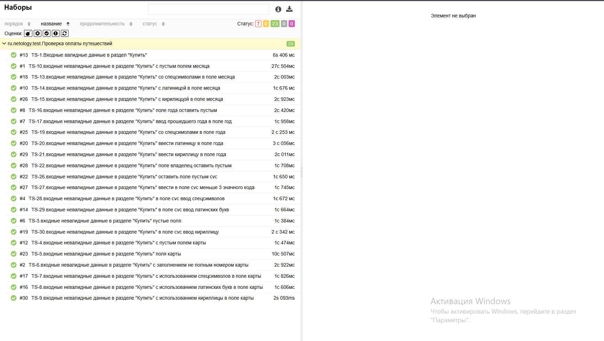
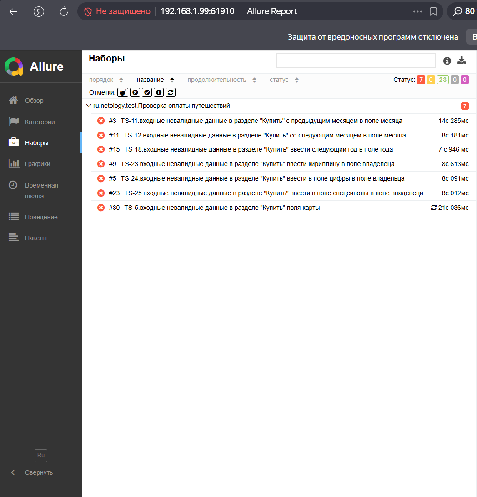

# Итог

## Краткое описание
Проведено автоматизированное тестирование модуля оплаты при покупке тура.
Тестирование осуществлялоь на основании [технического задания](https://github.com/netology-code/aqa-qamid-diplom),
разработанного на его основе [плана автоматизации тестирования](https://github.com/Nikita4651/Coursework/blob/main/docs/Plan.md),
включало ручное прохождение тестовых сценариев, автоматизированное тестирование
Набор тестов включает в себя 30 сценариев, реализованных на JUnit 5.
Проверены позитивные и негативные сценарии интеграции с СУБД (карты APPROVED/DECLINED),
а также валидация условий и всех форматов полей (номер карты, дата, год, имя владельца,  CVC, пустые значения).
Выявлены критические баги, при которых логика и валидация интерфейса работают некорректно.

**Использовалось тестовое окружение**:
* *Операционная система*: Windows 11 Pro 
* *IDE*: IntelliJ IDEA 2026.1.1
* *Java*: Open JDK 11
* *Docker Desktop* 4.82.0 (233772)
* *Браузер*: Google Chrome Версия: 150.0.7871.115 (официальная сборка) (64 бит)

## Итоги запуска тестов
* **1. Всего тест-кейсов**: 30
* **2. Успешные результаты**: 23 (76,66%)
* **3. Неудовлетворительные результаты**: 7 (23,33%)
* **4. По всем выявленным дефектам составленo**: 7 [баг-репорты](https://github.com/Nikita4651/Coursework/issues)
1. Gradle
 

2. Allure

## Протестированные сценарии
## Статус этапа PL-01
Описание этапа смотри в [Плане: PL-01](Plan.md#этап-pl-01-Перечень-автоматизируемых-сценариев)

### Общие рекомендации
* **В ходе тестирования формы оплаты были выявлены зоны роста, 
связанные с обратной связью для пользователя и стабильностью проверок. 
Реализация понятных сообщений об ошибках и фиксация требований по статусам операций позволит повысить удобство использования формы и обеспечить стабильное покрытие тестами.
После внедрения рекомендаций планируется повторный прогон автотестов с целью подтверждения устранения выявленных проблем и достижения целевого уровня покрытия.**:

1. Обеспечить понятную обратную связь при ошибках валидации даты.
При вводе некорректного срока действия карты (будущий месяц/год) система должна явно показывать пользователю причину ошибки. 
Отсутствие уведомлений оставляет пользователя в неопределённости и нарушает требования к удобству использования.
Рекомендуется выводить сообщение под соответствующим полем с однозначной формулировкой (например, «Недопустимая дата»).
При вводе кооректного срока действия карты (прошлый месяц) система не должна показывать ошибку и система должна проходить с валидной датой предыдущего месяца.
Уведомлений оставляет пользователя в неопределённости и нарушает требования к удобству использования.
Рекомендуется исправить логику и исправить валидацию поля месяца

2. Реализовать валидацию содержимого поля «Владелец» с корректными сообщениями об ошибках.
Для поля, где ожидается латиница, необходимо проверять ввод и отображать подсказки при обнаружении кириллицы, цифр или спецсимволов. 
Сообщения должны быть конкретными и помогать пользователю исправить ошибку (например, «Только латинские буквы», а не общее «Неверный формат»).
Это повысит удобство формы и снизит количество ошибочных отправлений.

3. Проверить и унифицировать тексты сообщений об ошибках.
Разные типы ошибок должны иметь понятные и различаемые формулировки.
Это важно как для конечного пользователя, так и для автоматизации: автотесты смогут стабильно находить нужные элементы по тексту, а пользователь—быстрее исправлять ввод.

* **Выполнить ретест исправленных дефектов**: После устранения выявленных проблем провести повторный запуск автотестов с полной очисткой промежуточных результатов.
Сформировать обновлённый Allure‑отчёт командой ./gradlew clean test allureReport,
чтобы подтвердить устранение дефектов и зафиксировать актуальное состояние покрытия

### Скриншот Allure-отчета:

